- links:
  collapsed:: true
	- 個人練細紀錄：
		- {{video https://www.youtube.com/watch?v=aKTFxFpGB-s}}
	- 教學鏈接：
		- 【吉他教程Kate Bush - Running Up That Hill怪奇物语插曲】 https://www.bilibili.com/video/BV1be4y1D7xA/?share_source=copy_web&vd_source=2878efc113b2b7866cf40e97680fe838
		-
	- https://tabs.ultimate-guitar.com/tab/kate-bush/running-up-that-hill-chords-1520628
- [[GUITAR]]
- #[[pro challenge]]
- chords
  collapsed:: true
	- 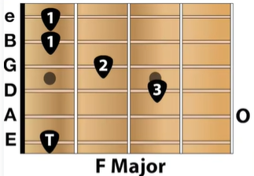 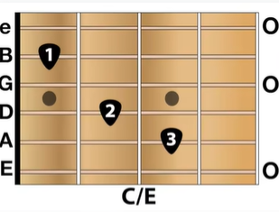
	- 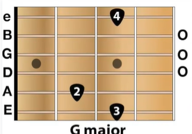 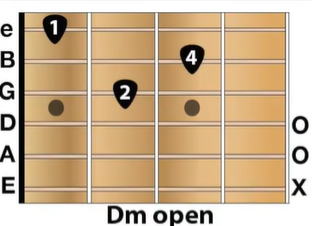
	- 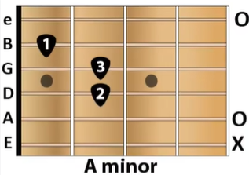 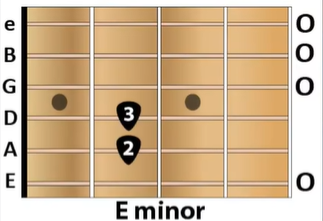
- 掃弦
  collapsed:: true
	- 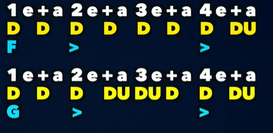
	- 大小大小大小小擦擦
	- 大小大嚓嚓嚓嚓大小擦擦
- song
  collapsed:: true
	- capo 3
	- intro
		- pic
			- 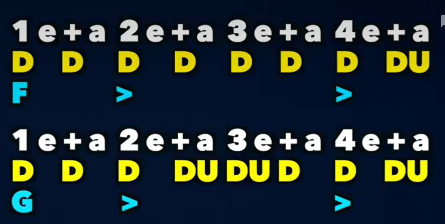
			- 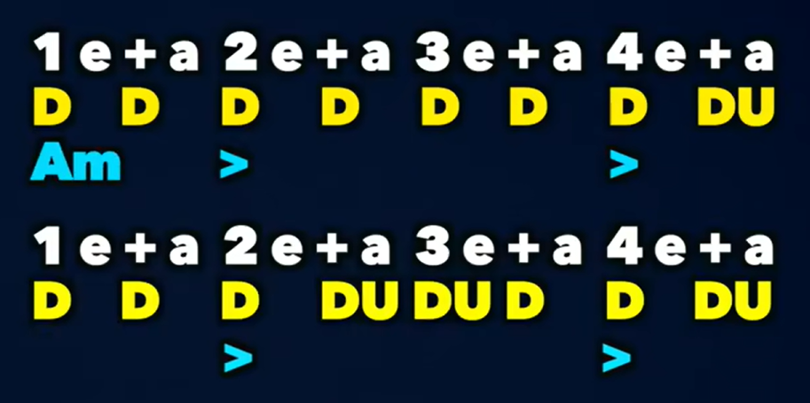
			- 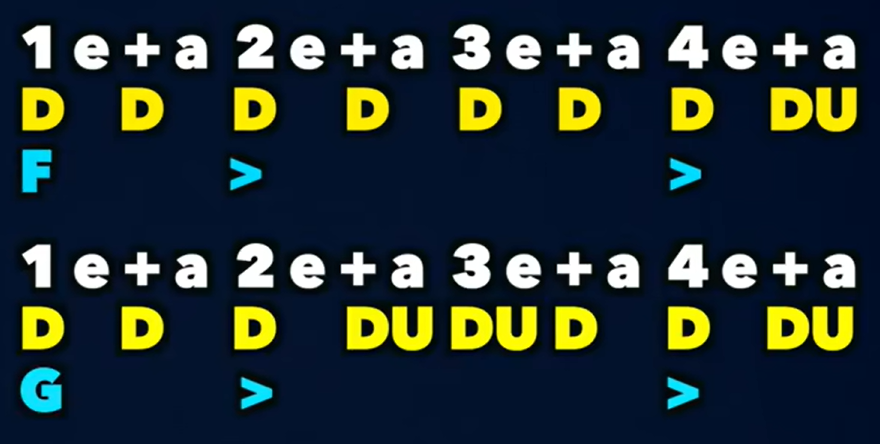
			- 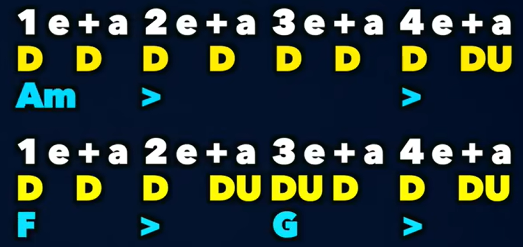
	- verse1
		- pic
			- 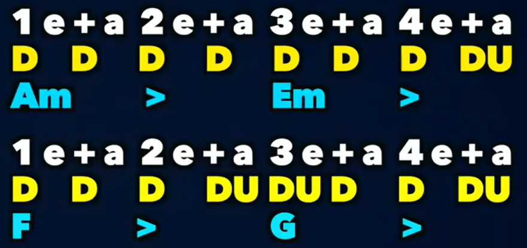
			- x3
	- pre-chorus
	  collapsed:: true
		- 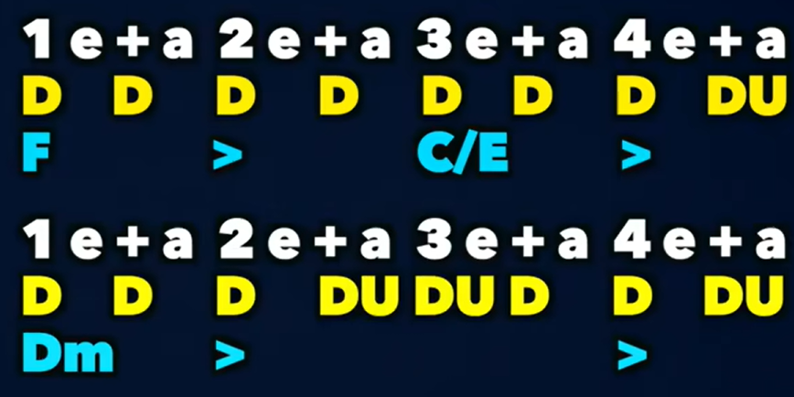
		- x2
		- fgam
	- verse2
		-
	- second chorus
		- 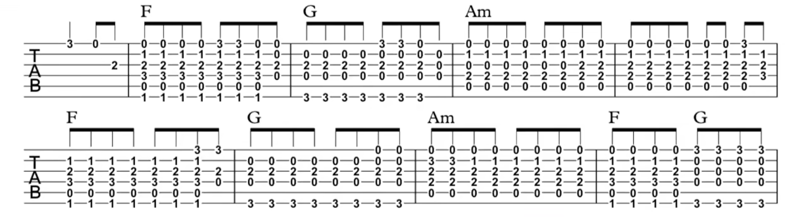
		- 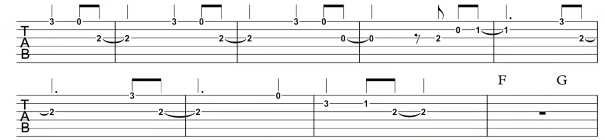
		- 節奏同樣的四組和弦 小小大小
		- 不同的和弦 小下下上 or 下小下上
		- 注意第七節，雖然圖下寫3二拍1四拍，但我為了整齊，在前一個二分音符就搞定312，也就是 下小下上 小小大小
		-
- afgafgafg
- aefgaefgaefg fcdfcd
- fgafgaafgafgafg
- aefgaefgaefg
- lyrics
  collapsed:: true
	- https://tabs.ultimate-guitar.com/tab/kate-bush/running-up-that-hill-chords-1520628
	- It doesn't hurt me (yeah, yeah, yo)
	  Do you wanna feel how it feels? (Yeah, yeah, yo)
	  Do you wanna know, know that it doesn't hurt me? (Yeah, yeah, yo)
	  Do you wanna hear about the deal that I'm making? (Yeah, yeah, yo)
	- You
	  It's you and me
	- And if I only could
	  I'd make a deal with God
	  And I'd get Him to swap our places
	  Be runnin' up that road
	  Be runnin' up that hill
	  Be runnin' up that building
	  Say, if I only could, oh
	- You don't wanna hurt me (yeah, yeah, yo)
	  But see how deep the bullet lies (yeah, yeah, yo)
	  Unaware I'm tearin' you asunder (yeah, yeah, yo)
	  Oh, there is thunder in our hearts (yeah, yeah, yo)
	  Is there so much hate for the ones we love? (Yeah, yeah, yo)
	  Oh, tell me, we both matter, don't we? (Yeah, yeah, yo)
	- You
	  It's you and me
	  It's you and me
	  Won't be unhappy
	- And if I only could
	  I'd make a deal with God
	  And I'd get Him to swap our places
	  Be runnin' up that road
	  Be runnin' up that hill
	  Be runnin' up that building (yo)
	  Say, if I only could, oh
	- You (yeah, yeah, yo)
	  It's you and me
	  It's you and me
	  Won't be unhappy (yeah, yeah, yo)
	- Oh, come on, baby (yeah)
	  Oh, come on, darlin' (yo)
	  Let me steal this moment from you now
	  Oh, come on, angel
	  Come on, come on, darlin'
	  Let's exchange the experience (yo), oh, ooh, ooh
	- And if I only could
	  I'd make a deal with God
	  And I'd get Him to swap our places
	  I'd be runnin' up that road
	  Be runnin' up that hill
	  With no problems
	  Say, if I only could
	  I'd make a deal with God
	  And I'd get Him to swap our places
	  I'd be runnin' up that road
	  Be runnin' up that hill
	  With no problems
	  Say, if I only could
	  I'd make a deal with God
	  And I'd get Him to swap our places
	  I'd be runnin' up that road
	  Be runnin' up that hill
	  With no problems
	  Say, if I only could
	  I'd be runnin' up that hill
	  With no problems
- TAB
	- riff
	- aefg x3
	- fcdm x2
	- fgam x3 +Riff
	- aefg x5
	- fcdm x3
	- fga x2+Riff(without last two)
	- fcdm x3
	- fga x2 +riff
	- fga x6
	- f
	- g
	- amx4