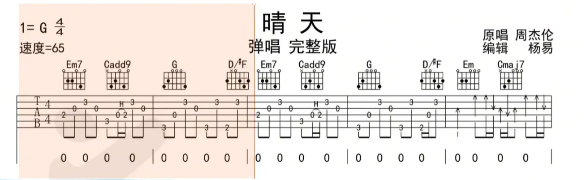

- [前奏 Intro]
  | Em7  Cadd9 | G  D/F# | Em7  Cadd9 | G  D/F# |
- [主歌 Verse 1] (使用分解和弦)
  G        D/F#      Em        Cmaj7
                   故事的小黃花
  G        D/F#      Em        Cmaj7
  從出生那年就飄著   童年的盪鞦韆
  G        D/F#      Em        Cmaj7
  隨記憶一直晃到現在
- Em       Cmaj7               G         D/F#
  Re So So Si Do Si La So La   Si Si Si Si La Si La So
  Em       Cmaj7               G         D/F#
  吹著前奏望著天空我           想起花瓣試著掉落
- [主歌 Verse 2] (使用分解和弦)
  G        D/F#      Em        Cmaj7
  為你翹課的那一天   花落的那一天
  G        D/F#      Em        Cmaj7
  教室的那一間       我怎麼看不見
  G        D/F#      Em        Cmaj7
  消失的下雨天       我好想再淋一遍
  G        D/F#      Em        Cmaj7
  沒想到失去的勇氣我 還留著
  G        D/F#      Em        Cmaj7
  好想再問一遍       你會等待還是離開
- [副歌 Chorus 1] (進入刷弦節奏)
  Em       C         D           G    B7
  颳風這天 我試過握著你手 但偏偏 雨漸漸
  Em       C         D           G    B7
  大到我看你不見 還要多久 我才能在你身邊
  Em       C         D           G
  等到放晴的那天 也許我會比較好一點
- Em        C           D         G    B7
  從前從前 有個人愛你很久 但偏偏 風漸漸 把距離吹得好遠
  Em       C         D             G    D     C
  好不容易 又能再多愛一天 但故事的最後你好像還是說了拜拜
- [間奏 Interlude]
  | Cadd9 | Am7 | C | D |
- [主歌 Verse 3] (回到分解和弦，或輕柔刷弦)
  G        D/F#      Em        Cmaj7
  為你翹課的那一天   花落的那一天
  G        D/F#      Em        Cmaj7
  教室的那一間       我怎麼看不見
  G        D/F#      Em        Cmaj7
  消失的下雨天       我好想再淋一遍
  G        D/F#      Em        Cmaj7
  沒想到失去的勇氣我 還留著
  G        D/F#      Em        Cmaj7
  好想再問一遍       你會等待還是離開
- [副歌 Chorus 2] (激烈刷弦)
  Em       C         D           G    B7
  颳風這天 我試過握著你手 但偏偏 雨漸漸
  Em       C         D           G    B7
  大到我看你不見 還要多久 我才能在你身邊
  Em       C         D           G
  等到放晴的那天 也許我會比較好一點
- Em        C           D         G    B7
  從前從前 有個人愛你很久 但偏偏 風漸漸 把距離吹得好遠
  Em       C         D             G    D     Cadd9  Am7  C  D
  好不容易 又能再多愛一天 但故事的最後你好像還是說了拜拜
- [尾奏 Outro] (維持刷弦，漸慢結尾)
  G          D/F#          Em7        Cmaj7
  颳風這天我試過握著你手但偏偏 雨漸漸
  G          D/F#          Em7        Cmaj7
  大到我看你不見 還要多久  我才能夠在你身邊
  Cadd9        Am7             C           D
  等到放晴那天 也許我會比較好一點
- G            D/F#        Em7         Cmaj7
  從前從前有個人愛你很久但偏偏 風漸漸把距離吹得好遠
  Cadd9        Am7             C             D       G
  好不容易又能再多愛一天 但故事的最後你好像還是說了拜拜
- 
-