- links
	- https://github.com/unlir/XDrive/blob/master/Hardware/XDrive_bom.xlsx
	-
- [[EDA]]
- #stable
- #3day
-
- 相關照片
  collapsed:: true
	- 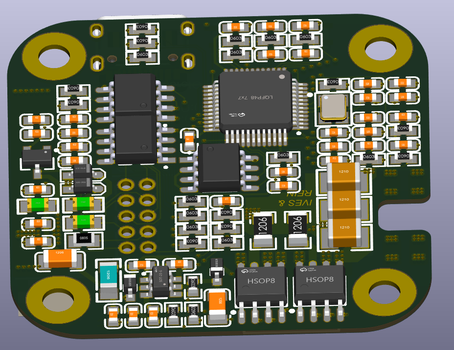
	- 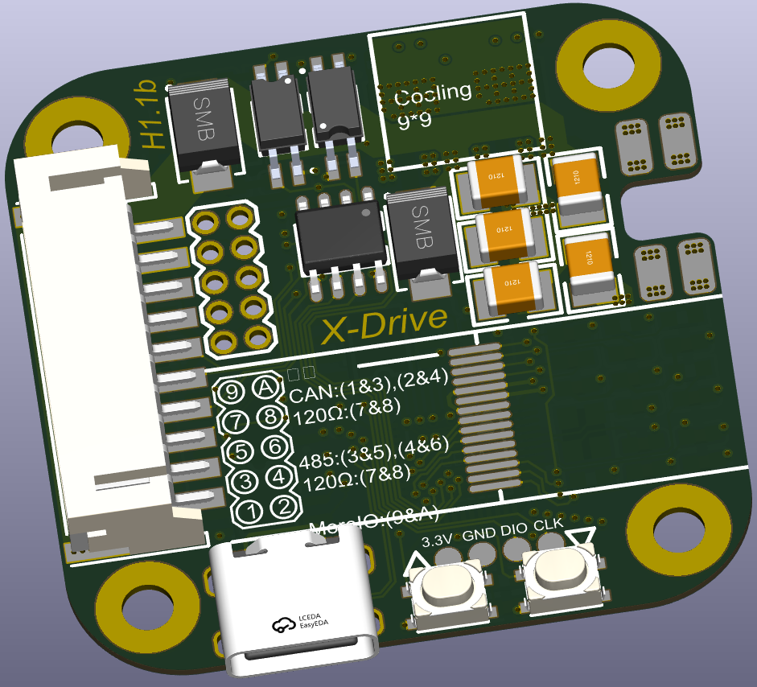
- 組件
	- type-c
	  collapsed:: true
		- 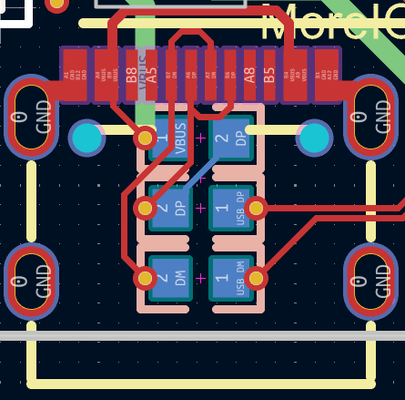
		- 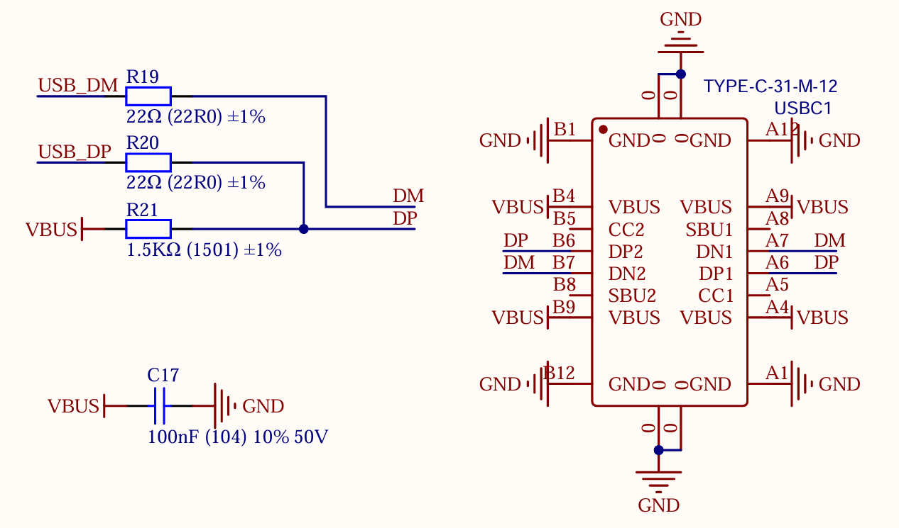
		- 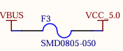
		-
		- 特點：使用12pin type-c去除了快速TX/RX，只有VBUS,GND,USB2.0(DP/DM兩組可以提供正反無視)
		- USB_DM/USB_DP接下拉電阻22歐姆做阻抗匹配，然後連接到mcu
		- CC1,2和SBUS1,2懸空，前者提供判斷主從設備，後者提供更強傳輸能力，讓Typec可以做為hdmi使用，懸空後不做功能，因為沒有cc1,2的下拉電阻，所以只有typea to typec線能使用
		- VBUS配上濾波電容，使用常見高頻100nF以及50v大電壓因為插拔風險
		- 焊接固定腳與角落腳位為gnd直接連到gnd層
		- 電容電阻被放置在其背面
		- 主要使用1,4層，VBUS為第二層
		- SMD0805提供0.5A的保險絲電流保護
		- 優化：提供cc1,2下拉電阻(5.1k歐姆)這樣我的typec to typec 線才能用
	- TB67 h橋馬達供電
	  collapsed:: true
		- 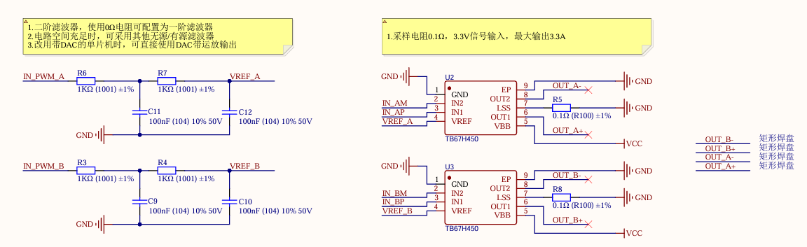
			-
		- 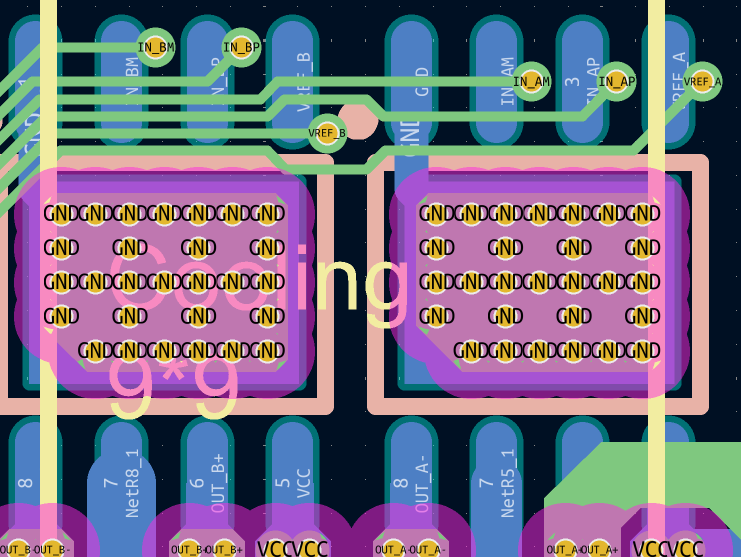
		- 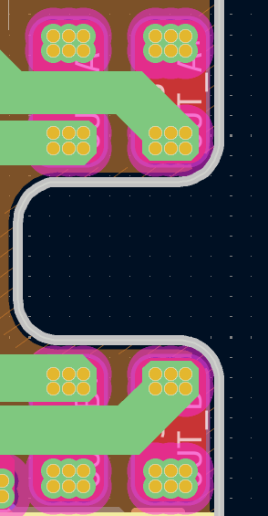
		-
		- 使用兩顆TB67H450fng，EL有散熱封裝，0,EL沒有
		- 因為MCU無法提供類比電壓作為VREFA需要的類比訊號，所以透過將數位訊號經由二階RC濾波平滑化成直流電壓
		- TB67H450fng的腳位須提供，IN1,IN2透過01,00,10,11的方式決定正轉反轉煞車自由四個可能(我沒照順序)，VREF為本次運轉的強度，會根據收到的電壓決定提給線圈的電流，VBB為馬達運轉的電壓來源，OUT+, OUT-直接和馬達相連提供一組線圈的電流，LSS微電流採樣端，和一個0.1歐姆電阻串聯接地，他會和VREF命令之電流進行比較，使得馬達線圈電流符合我們的要求
		- 其餘接地，焊盤也可以接地，並且在散熱部分打很多過孔提供更強散熱
		- OUT和馬達對接的部分採用大焊盤提供焊接功能，提供大量過孔用於增大面積
		- 主要使用1,3層，在大電流部分使用大量過孔增加面積，然後使用第三層獲取更大面積導線，然後訊號從第三層到mcu附近才切到第四層
		- 優化：改為TB67H450Afng為更新版本的，能適應低電流情景
	- V3.3濾波並聯電容
	  collapsed:: true
		- 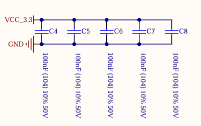
		- 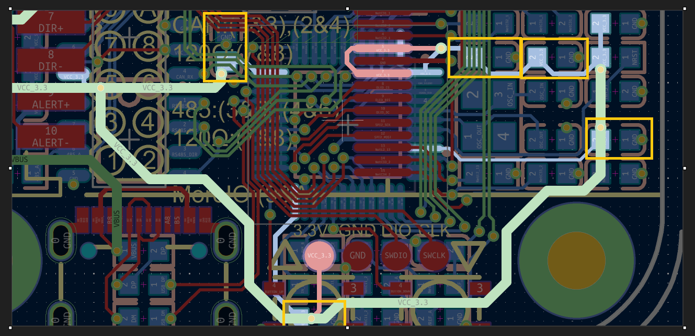
		- 雖然說這個並聯濾波說是要幫助減少雜訊但可以看到右側電容為了方便排列所以離mcu有距離，下方為提供給VCC3.3的焊盤使用，左側為就很近這樣
		- 使用標準100nF for 高頻雜訊
	- VCC穩流電容
	  collapsed:: true
		- 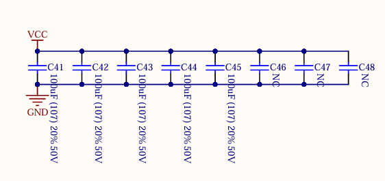
		- 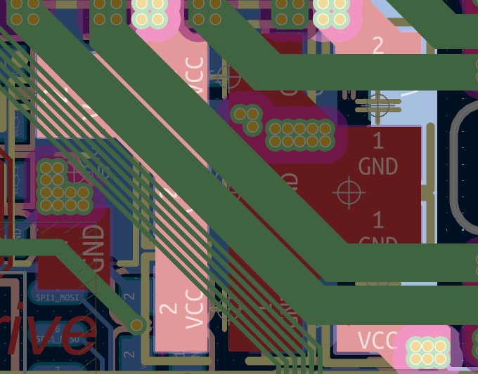
		- 正反兩面一共八顆100uF並聯電容，然後主要使用第一層，由於使用大電流所以可以多放過孔，然後要靠近馬達驅動晶片
	- 電流保護組件
	  collapsed:: true
		-
		- 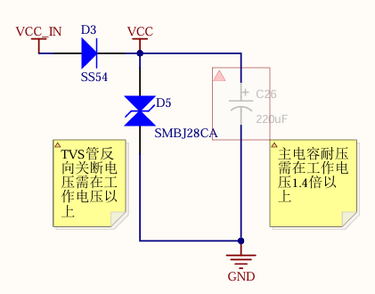
		- 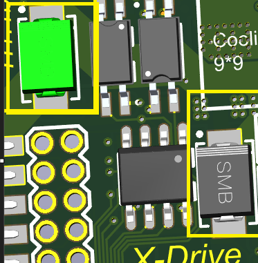
		- 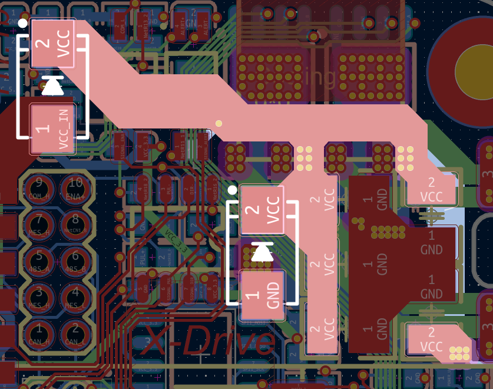
		- SS54為蕭特基二極體，順向壓降極低所以適合大電流經過，不會產生過多廢熱，並且切換速度極快，比一般的二極體能更快反制反向電流的衝擊，最大順向電流5A，比馬達驅動最大的3.3A小，然後反向防護最大為40V，只要反接不要超過40v就沒問題，順向壓降約為0.55V
		- SMBJ28CA為突波吸收保護二極體TVS，雙向順態電壓抑制，尾號CA就是雙向保護，特性是反應速度快，出現異常電壓(馬達反電動勢)可以從高阻抗快速崩潰，變成低阻抗路徑把多餘電流接地，反向關斷電壓28V超過工作電壓，擊穿電壓為31v to 34v，所以當電壓不管從哪個方向只要超過這個數字就會導通崩潰，峰值脈衝為600W，換言之能吸收這麼多能量，盡量放在電流進入口來做為保護
		-
		-
	- 轉5V組件
	  collapsed:: true
		- 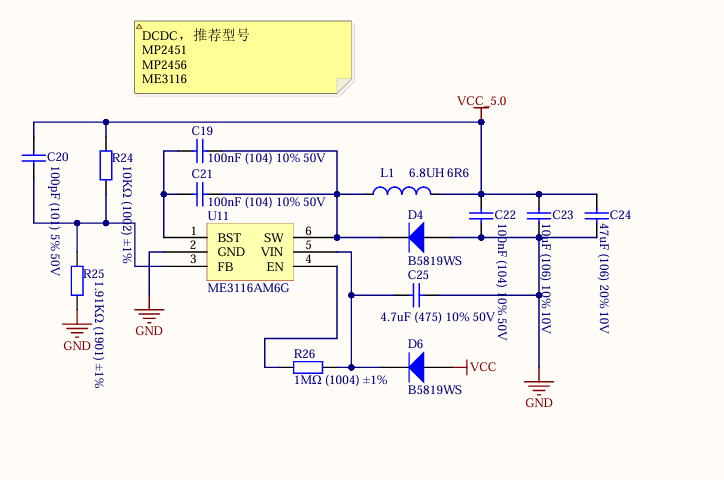
		- 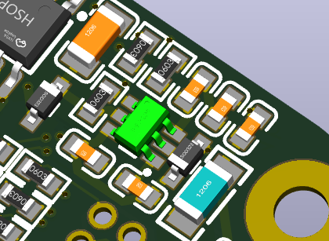
		  id:: 69c563a7-fb5b-43cf-83f4-204ef1c83422
		- 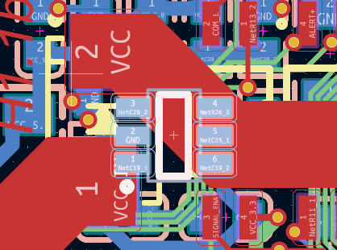
		-
		- ME3116AM6G，其中A為輸入電壓可調，G為環保，M6為六根腳，負責將9V to 30V轉為5V
		- VIN負責接收外部電壓VCC，配合B5819WS蕭特基二極體提供高頻響應和低順向壓降，配合4.7uF的電容穩流
		- EN為啟動控制，透過1M歐姆電阻上拉到VCC，這樣只要外部一有電就能開始運作
		- FB為電壓回授，使用10k歐姆電阻和1.91k歐姆電阻和輸出的5V，形成分壓電路，配合100pF電容作為前饋電容在高頻小波動時可以低容抗快速導通，使得FB能最快收到並反映
		- BST和SW共同作用生成5V，SW會快速的從VCC電壓和0V之間切換，然後經由6.8UH電感將其轉換為直流電，然後配合100nF以及47uF做濾波和穩流，然後在SW為0V時，B5819會導通順向迴路，使得電感電流可以形成迴路，如果沒有二極體就會使得SW為負壓炸掉晶片，然後C19,C21會吸收SW的電流，假設系統已穩定(因為我也不知道他一開始怎麼跑的)這兩個電容會是五伏特的電壓，然後當SW為0時，BST就會是0+5，SW為24時，BST就會是24+5，這樣就能保證形成一個MOSFET的漂亮高低壓以及輸出在二者中間的電壓
		- 接地就是接地
		- 很靠近VCC輸出源，放置在背面，導線也都在背面，沒有過孔，周的的電容電阻都很接近
	- 轉3V3組件
	  collapsed:: true
		- 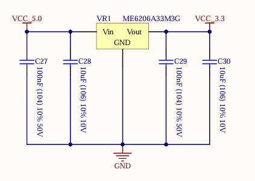
		- 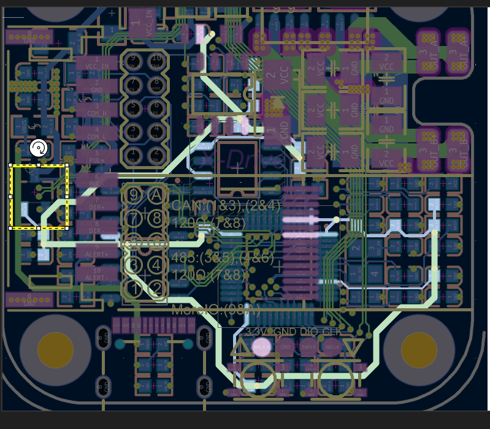
		- 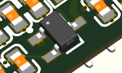
		- 將5V轉為3V，ME6206最大輸入電壓6V，最大輸出電流0.3A
		- 周邊有兩顆濾波兩顆穩流電容，5V部分的電容離晶片較遠，後者則非常近，因為像5V降壓晶片一樣，他也有回授電路，不過被集成再一起，所以需要讓後面的電容離的近一些，防止它們響應速度過慢導致電流無法穩定
		-
	- 電壓監控
	  collapsed:: true
		- 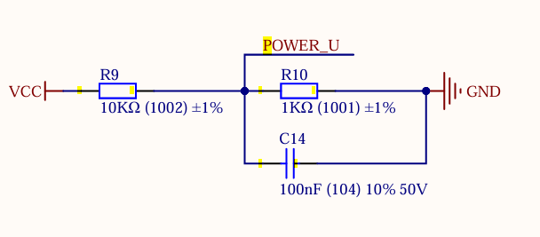
		- 使用10k和1k電阻形成1/11分壓，加上100nF電容濾波，然後信號傳給MCU的ADC，作為外部電壓監控
	- 磁編碼
	  collapsed:: true
		- 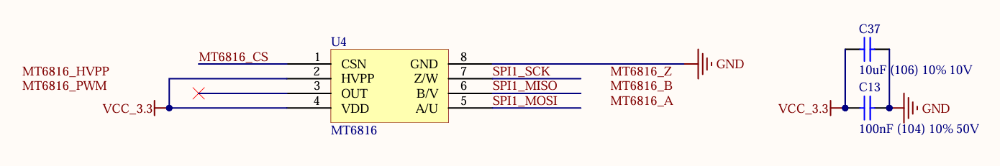
		- 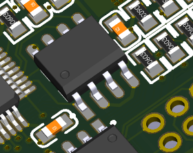
		- 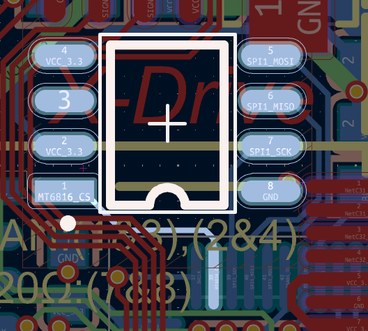
		- 使用10uF,100nF電容作為穩流濾波
		- CS片選只有在被拉低時晶片才能play one
		- 提供SPI完整的CLK,MOSI,MISO，沒人在乎abz所以我就不寫了
		- 接地就是接地
		- 使用3.3V
		- 因為使用SPI所以和晶片越近越好
	- OLED
	  collapsed:: true
		- 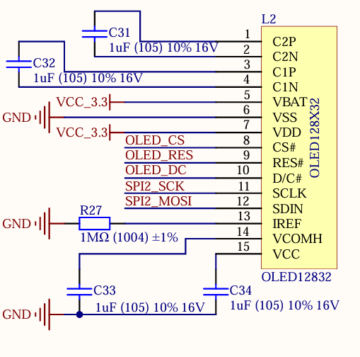
		- 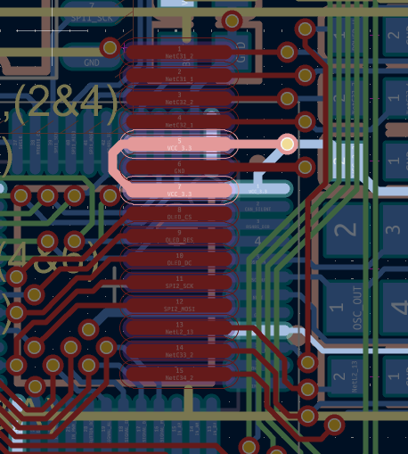
		- 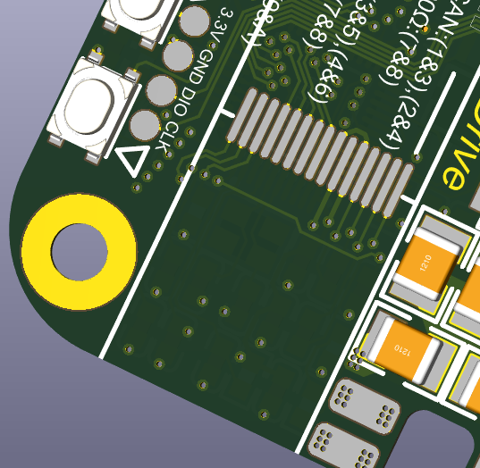
		- 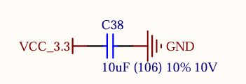 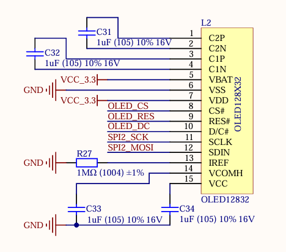
		- OLED提供畫面輸出，因為有SPI所以離mcu越近越好，提供10uF電容來穩流應對螢幕畫面更新電流大額輸出，型號為12832所以是128x32像素，MOSI為主設備輸出，有全套SPI，DC信號能表示接下來傳送的信號是螢幕要顯示的還是螢幕設定，RES能強制重啟，將OLED螢幕的設定初始化，其餘電容為螢幕本身晶片需要用到的穩流電容，所以才會出現電容兩邊都接腳，1M電阻作為二極體參考，設定螢幕最大亮度
		- 由於很難找到15pin未集成的Oled所以我改用socket
	- 按鈕
	  collapsed:: true
		- 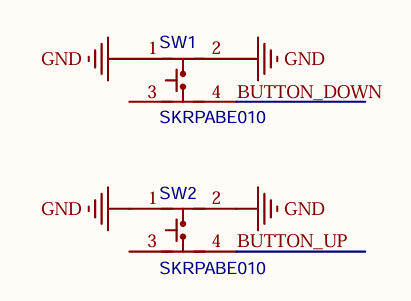
		- 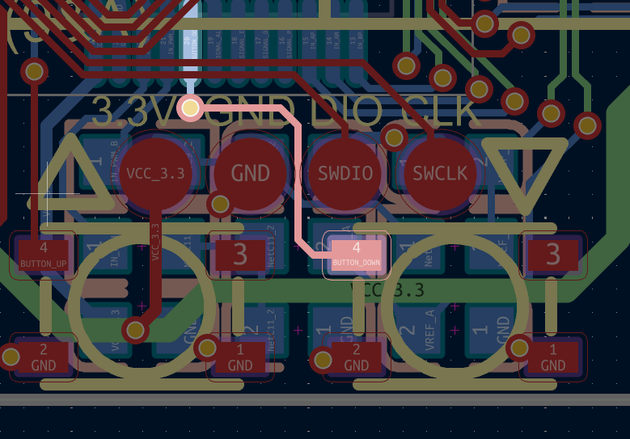
		- 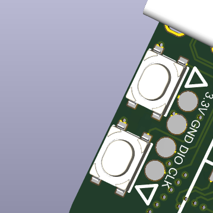
		- 配合晶片內部的上拉電阻，當按下時針腳電壓為0，沒有配置近距離電容，可以用Mcu算法消除抖動，在10ms to 20 ms再次檢測來判斷
		- 對距離沒有高要求
	- 插座和插針
	  collapsed:: true
		- 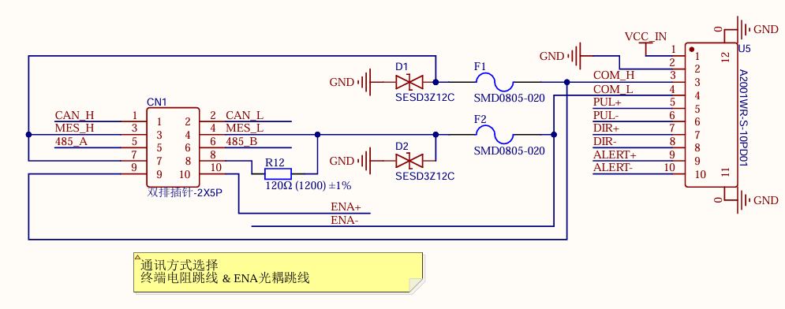
		- 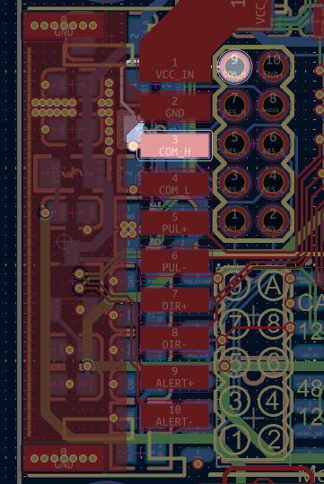
		- A2001為ph2.0端子插座，有VCC_IN可以作為輸入口，但很危險因為如果你原本就有電，插上去會有24V從插座跑出來，提供COMH,COML，可經由跳帽決定要作為CAN通訊或RS485通訊，還有PUL，DIR脈衝方向訊號作為傳統馬達運轉用，ALERT訊號輸出警告等訊息，COM部分配有雙向箝制和保險絲防止電壓電流攻擊晶片
		- 插針可通過配置MES和誰跳帽相連決定通訊方式，ENA+ENA-也能經由跳帽從COM轉換，然後78腳位只要裝跳帽就能並聯120歐姆電阻作為can總線終端匹配
		- RS485和CAN都提供一定距離的線路穩定，所以不用配置的離晶片很近
	- 插座接口保護
		- 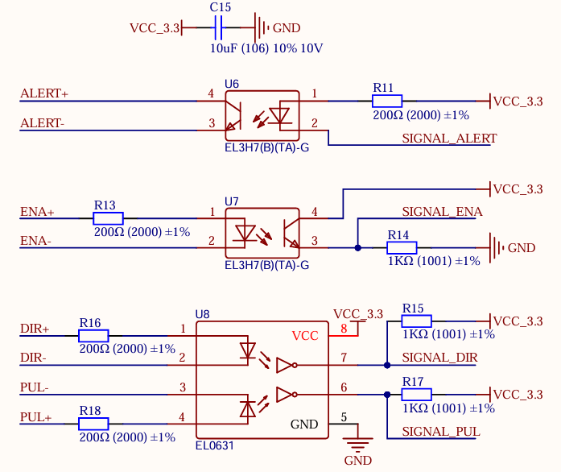
		- 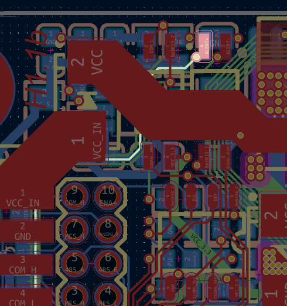
		- ALERT組，mcu經由控制signal，配上已經被電阻線流的3.3V，實現光電偶隔離產生差分ALERT信號
		- ENA組，透過外部產生ENA差分信號，然後讓被1k電阻下拉的signal被3.3v往上抬
		- 脈衝方向組和ENA組一樣
		- 光電偶將電信號轉成光再轉成電使得過高的訊號被隔離防止晶片受傷，並且不是透過訊號加上地線組合產生電壓差，而是差分信號，不需要共用地就不會有訊號干擾，因為ALERT,ENA,脈衝方向都是外部PLC供應，可能很不穩定
		- 電容被接在EL0631附近，因為它其實是會耗電的，為了提供高速信號，所以需要電容提供一點電
	- RS485
	  collapsed:: true
		- 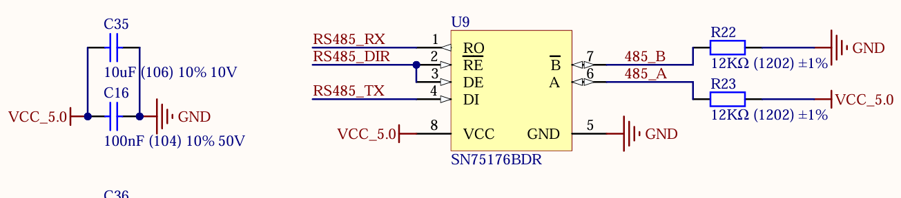
		- 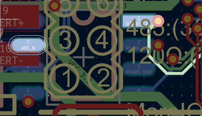
		- 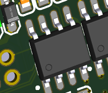
		- 使用5v供電，有TX,RX，DIR控制半雙工，還有485_A,B作為偏置電阻12k，A負責上拉到5V，B負責下拉到0，然後因為RE，DE都是for dir的一個負責判斷接收一個負責判斷傳輸，然後又剛好兩個人高低電為有效相反，所以接再一起會work，然後整理好的信號很脆弱所以離晶片很近，電容提供穩壓穩流，接地就接地
	- CAN
	  collapsed:: true
		- 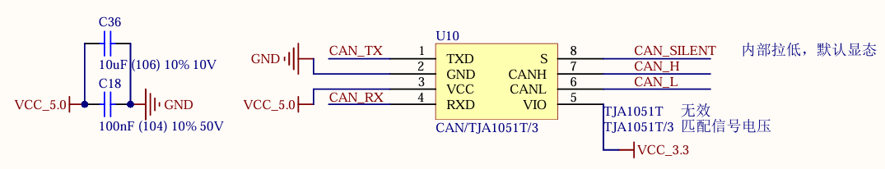
		- 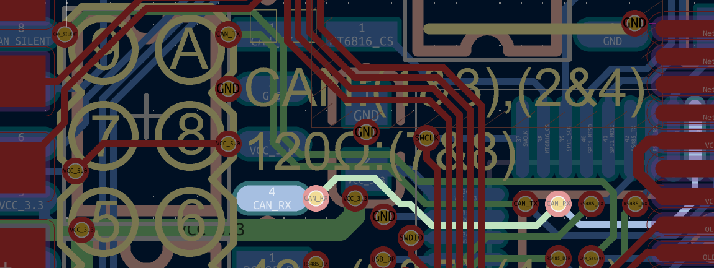
		- CAN通訊轉換，有HL差分信號，TX/RX和晶片傳輸(很脆弱所以離Mcu很近)，5V 作為主動和外部通訊時使用，3.3V作為和晶片溝通時使用，同樣有穩流濾波電容，CAN_SILENT被拉低時可以強制禁止外傳資料，防止Mcu有問題再can總線上亂傳資料
	- MCU
	  collapsed:: true
		- 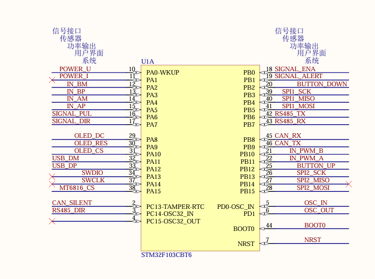
		- 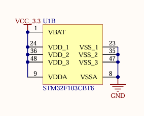
		-
		- 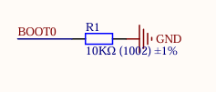
		- 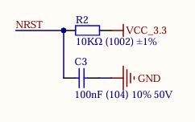
		- 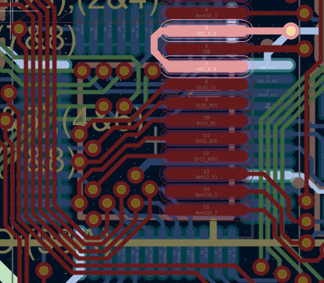
		- VBAT VDD1,2,3 VDDA連接3.3V，VSS1,2,3,A提供GND
		- 有OSC_IN OUT連接外部高頻晶振
		- POWER_U透過adc監控外部電壓
		- POWER_I原本預計監控外部電流但是沒使用到
		- 負責馬達驅動的INMP詳情見馬達驅動部分
		- signal pul dir 負責接收外部指令馬達脈衝方向
		- OLED周邊spi信號
		- 有USB DM DP差分信號
		- SWDIO/SWCLK被打叉因為他是直接透過焊盤和外部直連
		- MT6816周邊信號
		- RS485周邊信號
		- signal alert enable負責川書警告和使能for馬達
		- 上拉的button腳位
		- for oled的spi
		- can周邊通信
		- NRST低電位時不啟動，故使用100nF電容強迫mcu必須等到電容充飽後才能運作防止前期電壓狀態不穩，並使用電阻將其上拉
		- boot0被下拉，當boot0為低電位時預設以mcu，如果為高電位則使用廠商預先準備的flash進入燒錄狀態
	- Debug
	  collapsed:: true
		- 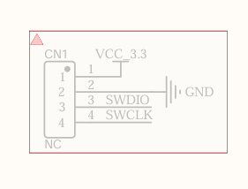
		- 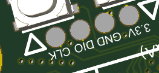
		- 直接用焊盤行式，就是常見的燒錄配置
	- 晶振
	  collapsed:: true
		- 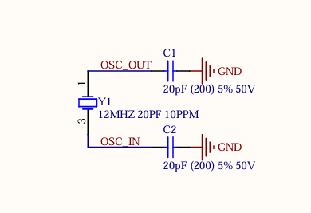
		- 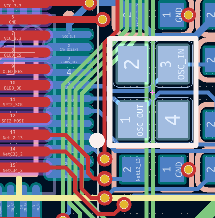
		- 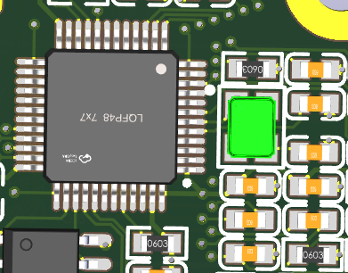
		- 提供12Mhz的時鐘信號，高頻且脆弱所以要離mcu很近
	-
- pcb機械設計
  collapsed:: true
	- 第一層
	  collapsed:: true
		- 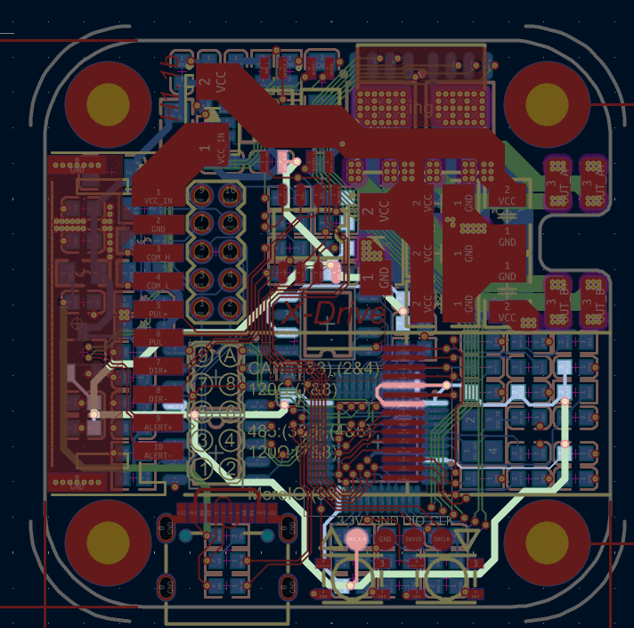
		- 作為VCC等大電流主要，以及貼在上側元件需要的走線，例如typec和oled Ph2.0
	- 第二層
	  collapsed:: true
		- 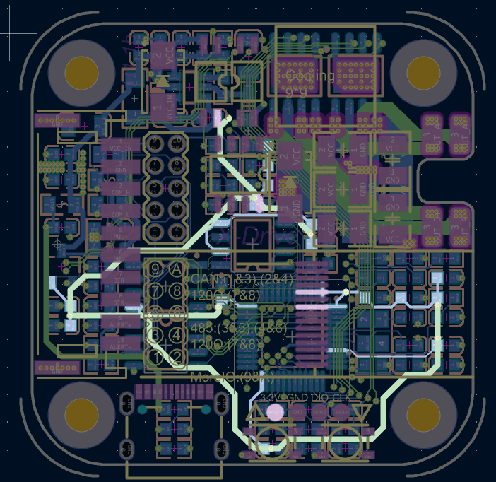
		- 輔助第一層的走線使用
	- 第三層
	  collapsed:: true
		- 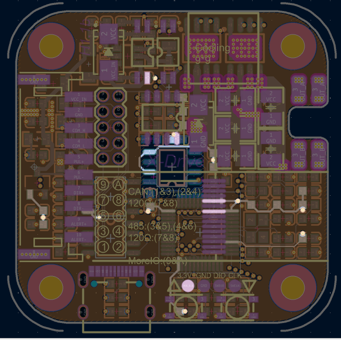
		- 提供GND層有鋪銅，中間的磁編碼要繞過防止波動
	- 第四層
	  collapsed:: true
		- 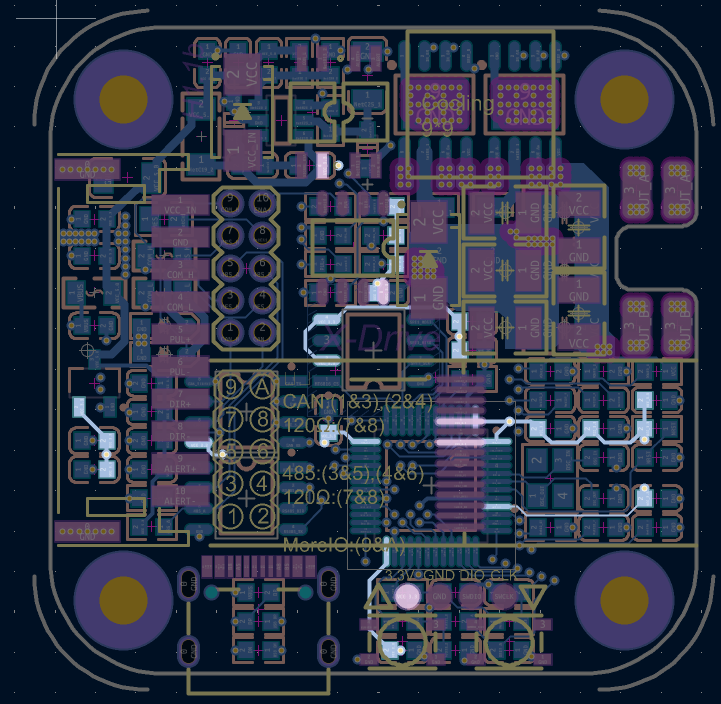
		- 作為下側主要電路走線，因為那一側零件很多所以要小心，一樣使用第二層作為主要輔助
	- 螺絲孔
	  collapsed:: true
		- 使用外徑6mm孔徑3mm孔洞四個
- nema17馬達
  collapsed:: true
	- 長寬Max42.3mm*42.3mm
	- 孔距31mm
	- 使用4-40 UNC螺絲
	- 用一個26mm配上兩個7mm半徑90度圓
	-
- conclusion
	- 相關圖片
	  collapsed:: true
		- 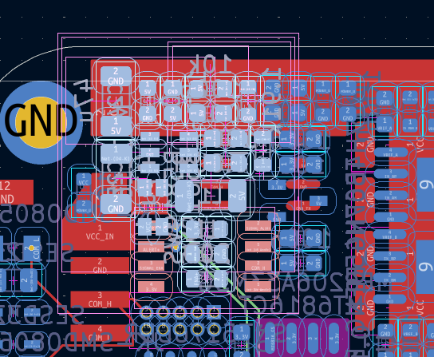
		- 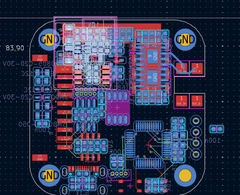
	- 3day loading test效果不錯，但會累，真的
	- 戰術是先把需要知道的東西都先看懂，把東西先分析乾淨，然後才開始執行，所以也能看見我最後的執行進度是到把pcb切好然後零件大概放好，但是對於繪製線路完全沒idea，kicad的差分線不理解，然後繪線真的很難，之後需要納入一開始的戰術前置分析
	- 有學到新東西，把LCSC import用的比較順暢了，對零件型號意義理解增加，學會怎麼用分組來整理和布置零件，還有怎麼話edge cut，我設計的時候發現找不到spi接口15pin oled，所以改成用i2c然後已經集成好的oled，然後notebooklm很好用，但要約束好pdf不然要跑很久，但可以一次問他很多問題，搭配Gemini處理簡單小問題是很好的組合
	- 這次的進度無法推進到繪線，怎麼布置比較整齊，差分線怎麼用，阻抗計算，都沒做好預備，穩流濾波的放置也沒做好，為了方便用整齊的排列會省很多力氣，但不能濫用，反正畫線很複雜，一定要做好前置分析，裡面很多黑科技
	-